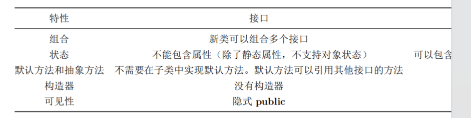

# 抽象类和方法
1. Java 提供了一个叫做抽象方法的机制，这个方法是不完整的：它只有声明没有方
法体。包含抽象方法的类叫做抽象类。如果一个类包含一个或多个抽象方法，那么类本身
也必须限定为抽象的，否则，编译器会报错。
2. 如果创建一个继承抽象类的新类并为之创建对象，那么就必须为基类的所有抽象方
   法提供方法定义。如果不这么做（可以选择不做），新类仍然是一个抽象类，编译器会
   强制我们为新类加上 abstract 关键字。
3. 可以将一个不包含任何抽象方法的类指明为 abstract，在类中的抽象方法没啥意
   义但想阻止创建类的对象时，这么做就很有用
4. private abstract 被禁止了是有意义

# 接口创建
1. 一个接口表示：所有实现了该接口的类看起来都像这样。因此，任何使用某特定接
   口的代码都知道可以调用该接口的哪些方法，而且仅需知道这些。所以，接口被用来建
   立类之间的协议。（一些面向对象编程语言中，使用 protocol 关键字完成相同的功能。）
2. Java 8 中接口稍微有些变化，因为 Java 8 允许接口包含默认方法和静态方法——基
   于某些重要原因。接口与抽象类最明显的区别可能就是使用上的惯用方式。接口的典型使用是代表
   一个类的类型或一个形容词，如 Runnable 或 Serializable，而抽象类通常是类层次结构
   的一部分或一件事物的类型，如 String 或 ActionHero。
3. 接口同样可以包含属性，这些属性被隐式指明为 static 和 final。
4. 默认方法：关键字 default 允许在接口中提供方法实现。增加默认方法的极具说服力的理由是它允许在不破坏已使用接口的代码的情况下，
   在接口中增加新的方法
```java

interface InterfaceWithDefault {
void firstMethod();
void secondMethod();
default void newMethod() {
System.out.println("newMethod");
}
}
```

##  多继承
1. 接口没有包袱——它只是方法外貌的描述，。因为接口中仍然不允许存在属性（只有静态属
性，不适用），所以属性仍然只会来自单个基类或抽象类，也就是说，不会存在状态的
多继承。
2. 现在我们做些在 Java 8 之前不可能完成的事：结合多个源的实现。只要基类方法
   中的方法名和参数列表不同，就能工作得很好，否则会得到编译器错误。如果相同？那你要override指定

## 接口的静态方法
能恰当地把工具功能置于接口中，从而
操作接口，或者成为通用的工具

```java
package onjava;
import java.util.*;
public interface Operations {
    void execute();

    static void runOps(Operations... ops) {
        for (Operations op : ops) {
            op.execute();
        }
    }
}

```
这是模版方法设计模式的一个版本（在 “设计模式” 一章中详细描述），runOps() 是
一个模版方法。runOps() 使用可变参数列表，因而我们可以传入任意多的 Operation
参数并按顺序运行它们：

# 抽象类和接口

尽可能地抽象。因此，更倾向使用接口而不是抽象类。只有当必
要时才使用抽象类。除非必须使用，否则不要用接口和抽象类。大多数时候，普通类已
经做得很好，如果不行的话，再移动到接口或抽象类中

## 完全解耦
当方法操纵的是一个类而非接口时，它就只能作用于那个类或其子类。如果想把方
法应用于那个继承层级结构之外的类，就会触霉头。接口在很大程度上放宽了这个限
制，因而使用接口可以编写复用性更好的代码。

- Applicator 的 apply() 方法可以接受任何类型的 Processor，并将其应用到一个
  Object 对象上输出结果。像本例中这样，创建一个能根据传入的参数类型从而具备不
  同行为的方法称为策略设计模式。方法包含算法中不变的部分，策略包含变化的部分。
  策略就是传入的对象，它包含要执行的代码。在这里，Processor 对象是策略，main()
  方法展示了三种不同的应用于 String s 上的策略

- Filter 类与 Processor 类具有相同的接口元素，但是因为它不是继承自 Processor
  —— 因为 Filter 类的创建者根本不知道你想将它当作 Processor 使用 —— 因此你不
  能将 Applicator 的 apply() 方法应用在 Filter 类上，即使这样做也能正常运行。主
  要是因为 Applicator 的 apply() 方法和 Processor 过于耦合，这阻止了 Applicator
  的 apply() 方法被复用。另外要注意的一点是 Filter 类中 process() 方法的输入输出
  都是 Waveform。

- 但如果 Processor 是一个接口，那么限制就会变得松动到足以复用 Applicator
  的 apply() 方法，用来接受那个接口参数。
```java
public interface Processor {
default String name() {
return getClass().getSimpleName();
}
Object process(Object input);
}
// interfaces/interfaceprocessor/Applicator.java
package interfaces.interfaceprocessor;
public class Applicator {
public static void apply(Processor p, Object s) {
System.out.println("Using Processor " + p.name());
System.out.println(p.process(s));
}
}

interface StringProcessor extends Processor {
    @Override
    String process(Object input); // [1]
    String S = "If she weighs the same as a duck, she's made of wood"; // [2]
    static void main(String[] args) { // [3]
        Applicator.apply(new Upcase(), S);
        Applicator.apply(new Downcase(), S);
        Applicator.apply(new Splitter(), S);
    }
}
class Upcase implements StringProcessor {
    // 返回协变类型
    @Override
    public String process(Object input) {
        return ((String) input).toUpperCase();
    }
}

```

这种方式运作得很好，然而你经常遇到的情况是无法修改类。例如在电子滤波器的
例子中，类库是被发现而不是创建的。在这些情况下，可以使用适配器设计模式。适配
器允许代码接受已有的接口产生需要的接口
```java
class FilterAdapter implements Processor {
Filter filter;
FilterAdapter(Filter filter) {
this.filter = filter;
}
@Override
public String name() {
return filter.name();
}

    @Override
    public Waveform process(Object input) {
        return filter.process((Waveform) input);
    }
}
public class FilterProcessor {
    public static void main(String[] args) {
        Waveform w = new Waveform();
        Applicator.apply(new FilterAdapter(new LowPass(1.0)), w);
        Applicator.apply(new FilterAdapter(new HighPass(2.0)), w);
        Applicator.apply(new FilterAdapter(new BandPass(3.0, 4.0)), w);
    }
}


```
在这种使用适配器的方式中，FilterAdapter 的构造器接受已有的接口 Filter，继
而产生需要的 Processor 接口的对象。你可能还注意到 FilterAdapter 中使用了委托。
协变允许我们从 process() 方法中产生一个 Waveform 而非 Object 对象。
将接口与实现解耦使得接口可以应用于多种不同的实现，因而代码更具可复用性。


# 多接口结合
可以向上转型为每个接口，因为每个接口都是独立的类型
- 使用接口的核心原因之一：为了能够向上转型为多个基类型
  （以及由此带来的灵活性）。然而，使用接口的第二个原因与使用抽象基类相同：防止客
  户端程序员创建这个类的对象，确保这仅仅只是一个接口
- ？如果创建不带任何方法定义或成员变量的基类，就选择接口而不
  是抽象类。事实上，如果知道某事物是一个基类，可以考虑用接口实现它

# 使用继承扩展接口
- 通过继承，可以很容易在接口中增加方法声明，还可以在新接口中结合多个接口。
这两种情况都可以得到新接口，extends 只能用于单一类，
但是在构建接口时可以引用多个基类接口。
- 当打算组合接口时，在不同的接口中使用相同的方法名通常会造成代码可读性的混
  乱，尽量避免这种情况

# 接口适配

接口的一种常见用法是前面提到的策略设计模式。编写一个方法执行某些操
作并接受一个指定的接口作为参数。可以说：“只要对象遵循接口，就可以调用方法” ，
这使得方法更加灵活，通用，并更具可复用性。

例子：Scanner中的Readable接口。假设你有一个类没有实现 Readable 接口，怎样才能让 Scanner 作用于它呢？下
面是一个产生随机浮点数的例子

我们可以再次使用适配器模式，但这里适配器类可以实现两个接口。因此，通过关键
字 interface 提供的多继承，我们可以创建一个既是 RandomDoubles，又是 Readable
的类：

```java
public interface RandomDoubles {
    Random RAND = new Random(47);
    default double next() {
        return RAND.nextDouble();
    }
    static void main(String[] args) {
        RandomDoubles rd = new RandomDoubles(){};
        for (int i = 0; i < 7; i++) {
            System.out.println(rd.next() + " ");
        }
    }
}


public class AdaptedRandomDoubles implements RandomDoubles, Readable {
private int count;
public AdaptedRandomDoubles(int count) {
this.count = count;
}
@Override
public int read(CharBuffer cb) {
if (count-- == 0) {
return -1;
}
String result = Double.toString(next()) + " ";
cb.append(result);
return result.length();
}
public static void main(String[] args) {
Scanner s = new Scanner(new AdaptedRandomDoubles(7));
while (s.hasNextDouble()) {
System.out.print(s.nextDouble() + " ");
}
}
}

```

# 接口字段
- 更加强大和灵活的关键字 enum，那么在接口中定义常
量组就显得没什么意义了。

- 接口中定义的字段不能是 “空 final”，但是可以用非常量表达式初始化。
- 接口嵌套

# 接口和工厂方法模式
```java
// interfaces/Factories.java
interface Service {
void method1();
void method2();
}
interface ServiceFactory {
Service getService();
}
class Service1 implements Service {
Service1() {} // Package access
@Override
public void method1() {
System.out.println("Service1 method1");
}
@Override
public void method2() {
System.out.println("Service1 method2");
}
}
class Service1Factory implements ServiceFactory {
@Override
public Service getService() {
return new Service1();
}
}


public class Factories {
    public static void serviceConsumer(ServiceFactory fact) {
        Service s = fact.getService();
        s.method1();
        s.method2();
    }
    public static void main(String[] args) {
        serviceConsumer(new Service1Factory());
// Services are completely interchangeable:
        serviceConsumer(new Service2Factory());
    }
}
```


- 为什么要添加额外的间接层呢？一个常见的原因是创建框架。假设你正在创建一个
  游戏系统；例如，在相同的棋盘下国际象棋和西洋跳棋：
```java
interface Game {
boolean move();
}
interface GameFactory {
Game getGame();
}
class Checkers implements Game {
private int moves = 0;
private static final int MOVES = 3;
@Override
public boolean move() {
System.out.println("Checkers move " + moves);
return ++moves != MOVES;
}
}
class CheckersFactory implements GameFactory {
@Override
public Game getGame() {
return new Checkers();
}
}
class Chess implements Game {
    private int moves = 0;
    private static final int MOVES = 4;
    @Override
    public boolean move() {
        System.out.println("Chess move " + moves);
        return ++moves != MOVES;
    }
}
class ChessFactory implements GameFactory {
    @Override
    public Game getGame() {
        return new Chess();
    }
}
public class Games {
    public static void playGame(GameFactory factory) {
        Game s = factory.getGame();
        while (s.move()) {
            ;
        }
    }
    public static void main(String[] args) {
        playGame(new CheckersFactory());
        playGame(new ChessFactory());
    }
}
```
如果类 Games 表示一段很复杂的代码，那么这种方式意味着你可以在不同类型的
游戏里复用这段代码。你可以再想象一些能够从这个模式中受益的更加精巧的游戏

# 总结
任何抽象性都应该是由真正的需求驱动的。当有必要时才应该使用接口进行重构，
而不是到处添加额外的间接层，从而带来额外的复杂性。这种复杂性非常显著，如果你
让某人去处理这种复杂性，只是因为你意识到 “以防万一” 而添加新接口

恰当的原则是优先使用类而不是接口。从类开始，如果使用接口的必要性变得很明
确，那么就重构。


