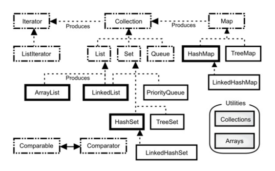

Java 提供了许多保存对象的方法：
1. 数组将数字索引与对象相关联。它保存类型明确的对象，因此在查找对象时不必
   对结果做类型转换。它可以是多维的，可以保存基本类型的数据。虽然可以在运
   行时创建数组，但是一旦创建数组，就无法更改数组的大小。
2. Collection 保存单一的元素，而 Map 包含相关联的键值对。使用 Java 泛型，可
   以指定集合中保存的对象的类型，因此不能将错误类型的对象放入集合中，并且
   在从集合中获取元素时，不必进行类型转换。各种 Collection 和各种 Map 都可
   以在你向其中添加更多的元素时，自动调整其尺寸大小。集合不能保存基本类型，
   但自动装箱机制会负责执行基本类型和集合中保存的包装类型之间的双向转换。
3. 像数组一样，List 也将数字索引与对象相关联，因此，数组和 List 都是有序集合。
4. 如果要执行大量的随机访问，则使用 ArrayList ，如果要经常从表中间插入或删
   除元素，则应该使用 LinkedList 。
5. 队列和堆栈的行为是通过 LinkedList 提供的。
6. Map 是一种将对象（而非数字）与对象相关联的设计。HashMap 专为快速访
   问而设计，而 TreeMap 保持键始终处于排序状态，所以没有 HashMap 快。
   LinkedHashMap 按插入顺序保存其元素，但使用散列提供快速访问的能力。
7. Set 不接受重复元素。HashSet 提供最快的查询速度，而 TreeSet 保持元素处于
   排序状态。LinkedHashSet 按插入顺序保存其元素，但使用散列提供快速访问的
   能力。
8. 不要在新代码中使用遗留类 Vector ，Hashtable 和 Stack 。
   浏览一下 Java 集合的简图（不包含抽象类或遗留组件）会很有帮助。这

Map 和 Collection 之间唯一的交集是 Map 可以使用 entrySet()
和 values() 方法来产生 Collection 。
请注意，标记接口 java.util.RandomAccess 附加到了 ArrayList 上，但不附加
到 LinkedList 上。这为根据特定 List 动态改变其行为的算法提供了信息。
