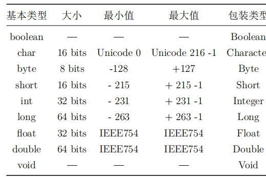

# 对象操作
通过引用来控制对象，引用一般都有一个与之关联的对象。

# 数据存储
1. 寄存器：CPU内部，存储区域最快，但是程序员不感知，不能操纵。
2. 栈内存：内存RAM中，移动栈顶指针分配与释放内存
3. 堆内存：所有java对象都存在这里
4. 常量存储：字符串常量池：在静态存储中
5. 非RAM存储：序列化对象| 持久化对象。

# 基本类型的存储
存储在栈中。如果想要存储在堆中，就要用包装类。

高精度数值，BigInteger BigDecimal

# 数组和对象的存储

# 代码注释
单行、多行、文档

# 对象清理
1. 看作用域
- 代码块

# 类的创建
1. 类型
- 字段
  - 注意[note.md](note.md)基本类型的默认值。（局部变量没有）
- 方法：
  - 方法名和参数列表：方法签名，作为方法的唯一标识
  - 方法的返回值需要兼容。
  - 调用方法的行为可以看成是向对象发送消息。

# 程序编写
1. 命名可见性。域名反写作为包名
2. import组件，*
3. static关键字
- 只想为特定字段（属性、域）分配一个共享存储空间，不考虑创建对象
- 创建一个与此类任何对象无关的方法，没有创建对象，也可以调用该方法

# 编译和运行
javac xxx.java
java xxx

# 编码风格
1. 类名：单词都大写。
2. 方法名、字段名：首字母不需要大写，其他需要。
3. 