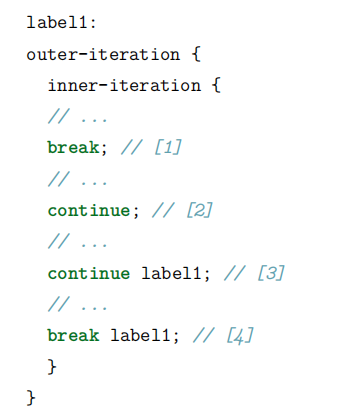

if else 
while
do while
for[初始化时用到的逗号运算符]
forEach循环,用于任何可迭代对象。

静态导入range

return
break
continue
goto？ 带标签的break与continue：唯一的理由是因为有循环嵌套存在，并且想从多层嵌套中break或者continue

switch case 穿透。default
【int char String enum】

命令行传递参数
java xxx args

